## 📌 Project Description

The application loads and displays a list of countries, allowing users to filter, search, and sort them. The main focus of this task is optimizing performance using `React.memo`, `useMemo`, and `useCallback`.

## ✅ General Summary of Optimization

### 🔍 Initial State (Before Optimization)

- Nearly all interactive actions (filtering, sorting, searching, marking as visited) triggered **full re-renders of the country list and all 250 items**.
- Main reasons included:
  - Non-memoized functions (`onClick`, `onSort`, `onRegionChange`, `onChange`)
  - State objects (`sortConfig`, `visitedCountries`) were re-created on every render
  - Component props changed even when values remained the same
- **Overall commit duration** often exceeded **140–150 ms**, resulting in noticeable UI lags.

### 🚀 Optimized State (After Optimization)

- Applied techniques:

  - `React.memo` for `CountryListItem`, `Select`, `SearchInput`, `CountryFilteringPanel`
  - `useMemo` for memoizing the filtered and sorted country list
  - `useCallback` for stabilizing all event handlers

- As a result:
  - Most components **stopped re-rendering** unless their props truly changed
  - Only relevant components were re-rendered (e.g., a single `CountryListItem` instead of all 250)
  - **Overall commit durations dropped to ~1–3 ms** in almost all cases

### 📉 Numeric Results

| Action               | Commit Duration (Before) | Commit Duration (After) |
| -------------------- | ------------------------ | ----------------------- |
| Filter by Region     | ~150+ ms                 | ~3.4 ms                 |
| Sort by Name (ASC)   | ~140+ ms                 | ~1.6 ms                 |
| Search by Name (“i”) | ~27.2 ms                 | ~1.1 ms                 |
| Click Country Card   | ~34.3 ms                 | ~2.9 ms                 |

---

## ✅ Details of Profiling

### 📊 Profiling Results of Filter By Region

#### 🧪 Actions Performed

- Clicked on the Region Select
- Selected a specific region (e.g., "Americas") to filter the country list

#### ✅ Summary of Observations

- Before optimization, all filtering-related components (`Select`, `CountryFilteringPanel`, `SearchInput`) re-rendered unnecessarily. After optimization, they remained stable thanks to memoization and stable props.

- `CountryList` initially re-rendered fully on both dropdown open and region selection, taking **over 70 ms**. After optimization, it re-rendered **only once** with **memoized filtered data**, reducing render time to **~1.5 ms**.

- `CountryListItem` components used to re-render **all 250 items** due to recreated callbacks and prop changes, costing ~80 ms total. After applying `React.memo` and stabilizing `onClick`, they no longer re-rendered.

- Overall commit duration dropped from over **150 ms** to just **~3.4 ms**, significantly improving responsiveness.

The detailed performance metrics are shown below.

| Interaction             | Component               | Render Reason (Before)                                    | Render Reason (After)                      | Render Duration (Before) | Render Duration (After) | Commit Duration (Before) | Commit Duration (After) |
| ----------------------- | ----------------------- | --------------------------------------------------------- | ------------------------------------------ | ------------------------ | ----------------------- | ------------------------ | ----------------------- |
| Click on Region Select  | `CountryList`           | Updated `sortConfig`, `selectedRegion`, rerendered parent | Memoized and only changed `countries`      | \~32.8 ms                | \~1.5 ms                | \~32.8 ms                | \~3.4 ms                |
|                         | `CountryListItem` (250) | Re-created `visitCountry` callback                        | Skipped due to `React.memo` + stable props | \~0.3–0.4 ms per item    | \~0 ms                  | \~80 ms total            | \~0 ms                  |
|                         | `CountryFilteringPanel` | Updated `sortConfig` object and `onRegionChange` callback | Memoized, no change                        | \~1 ms                   | \~0 ms                  | \~1 ms                   | \~0 ms                  |
|                         | `Select` (3)            | New `onChange` handlers and changing `value` props        | Skipped – props unchanged                  | \~0.2–0.4 ms each        | \~0 ms                  | \~1 ms total             | \~0 ms                  |
|                         | `SearchInput`           | New `onChange` from parent                                | Skipped – props unchanged                  | \~0.4 ms                 | \~0 ms                  | \~0.4 ms                 | \~0 ms                  |
| Select region from list | `CountryList`           | Filtered countries list changed (`useMemo`)               | Same memoized result                       | \~39.8 ms                | \~1.5 ms                | \~39.8 ms                | \~3.4 ms                |
|                         | `CountryListItem` (250) | Newly created `onClick`                                   | Skipped due to stable memoized props       | \~0.3–0.4 ms per item    | \~0 ms                  | \~80 ms total            | \~0 ms                  |
|                         | `CountryFilteringPanel` | Prop changes from parent                                  | No re-render                               | \~1 ms                   | \~0 ms                  | \~1 ms                   | \~0 ms                  |
|                         | `Select` (3)            | Change in `value` and non-memoized `onChange`             | Memoized, props unchanged                  | \~0.2–0.4 ms each        | \~0 ms                  | \~1 ms total             | \~0 ms                  |
|                         | `SearchInput`           | New `onChange` from parent                                | No re-render                               | \~0.4 ms                 | \~0 ms                  | \~0.4 ms                 | \~0 ms                  |

### 🖼️ Visual Chart Comparison - Filter by Region

| View                                      | Before Optimization                  | After Optimization                    |
| ----------------------------------------- | ------------------------------------ | ------------------------------------- |
| 🔥 Flame Graph – Click on Region Select   |   | _No re-renders observed_              |
| 🔥 Flame Graph – Select Region from List  |  | 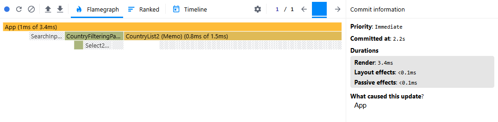 |
| 📈 Ranked Chart – Click on Region Select  |  | _No re-renders observed_              |
| 📈 Ranked Chart – Select Region from List |  | 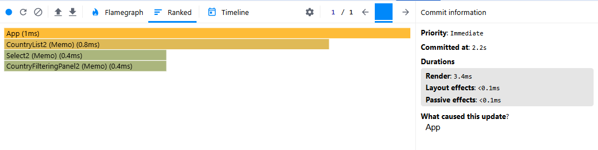 |
| 🕒 Timeline                               |  | 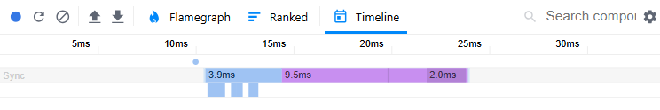 |

---

### 📊 Profiling Results of Sort By Name

#### 🦪 Actions Performed

- Clicked on the "Sort by Name" dropdown
- Selected alphabetical sort order: `ascending`

#### ✅ Summary of Observations

- `CountryList` was fully re-rendered before optimization due to sort configuration changes (~33–39 ms), but after applying `useMemo`, it rendered only the updated result (~0.9 ms).

- `CountryListItem` (250 items) previously re-rendered completely (~84–86 ms total) due to new `onClick` references. After applying `React.memo` and stabilizing callbacks, re-renders were eliminated (~0 ms).

- `CountryFilteringPanel` and all `Select` components re-rendered before optimization because of recreated handlers and updated props. After optimization, these components remained stable and didn’t re-render.

- Overall commit duration was reduced from over **140 ms** to just **~1.6 ms**, resulting in significantly improved responsiveness.Commit duration dropped from over **140 ms** to **\~1.6 ms** 🚀

The detailed performance metrics are shown below.

| Interaction                  | Component               | Render Reason (Before)                        | Render Reason (After)             | Render Duration (Before) | Render Duration (After) | Commit Duration (Before) | Commit Duration (After) |
| ---------------------------- | ----------------------- | --------------------------------------------- | --------------------------------- | ------------------------ | ----------------------- | ------------------------ | ----------------------- |
| Click on Sort By Name Select | `CountryList`           | Rerender from sorting triggered by sortConfig | Memoized sort result              | \~33.5 ms                | \~0.9 ms                | \~33.5 ms                | \~1.6 ms                |
|                              | `CountryListItem` (250) | Re-created `onClick` callback per item        | Skipped due to `React.memo`       | \~0.3–0.4 ms per item    | \~0 ms                  | \~86 ms total            | \~0 ms                  |
|                              | `CountryFilteringPanel` | Updated due to new sort handler               | Memoized and stable props         | \~1.2 ms                 | \~0 ms                  | \~1.2 ms                 | \~0 ms                  |
|                              | `Select` (3)            | onChange recreated, value changed             | Skipped – props unchanged         | \~0.3–0.4 ms each        | \~0 ms                  | \~1 ms total             | \~0 ms                  |
| Select ASC Sorting           | `CountryList`           | Sorted list recalculated, triggered rerender  | Already memoized sort result      | \~39.2 ms                | \~0.9 ms                | \~39.2 ms                | \~1.6 ms                |
|                              | `CountryListItem` (250) | New onClick reference, rerender all           | Skipped due to memoized `onClick` | \~0.3–0.4 ms per item    | \~0 ms                  | \~84 ms total            | \~0 ms                  |
|                              | `CountryFilteringPanel` | New sortConfig reference                      | Memoized and stable props         | \~1.1 ms                 | \~0 ms                  | \~1.1 ms                 | \~0 ms                  |
|                              | `Select` (3)            | Value and onChange updated                    | Skipped – props unchanged         | \~0.3–0.4 ms each        | \~0 ms                  | \~1 ms total             | \~0 ms                  |

---

### 🖼️ Visual Chart Comparison - Sort by Name

| View                                           | Before Optimization                    | After Optimization                     |
| ---------------------------------------------- | -------------------------------------- | -------------------------------------- |
| 🔥 Flame Graph – Click on Sort By Name Select  |  | _No re-renders observed_               |
| 🔥 Flame Graph – Select Asc Sorting            |  | 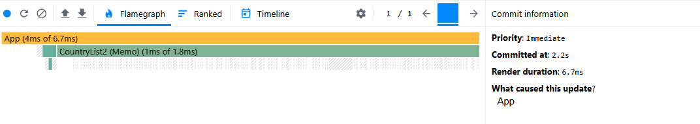 |
| 📈 Ranked Chart – Click on Sort By Name Select |  | _No re-renders observed_               |
| 📈 Ranked Chart – Select Asc Sorting           |  | 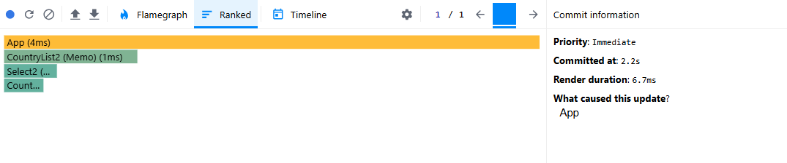 |
| 🕒 Timeline                                    |     |   |

---

### 📊 Profiling Results of Search Country

#### 🧪 Actions Performed

- Clicked on the "Search" Input
- Typed "i" in it

#### ✅ Summary of Observations

- **Before optimization**, clicking on the `SearchInput` triggered re-renders in `SearchInput`, `Select`, and `CountryFilteringPanel`.  
  **After optimization**, these components stayed stable due to memoized props and stable references.

- **Typing** in the input caused the `CountryList` to re-render completely (**~27.2 ms**) before optimization.  
  **After applying `useMemo`**, this was reduced to **~1.1 ms**.

- **250 `CountryListItem` components** were re-rendered due to re-created `onClick` handlers (**~65 ms total**).  
  **After optimization with `React.memo` and `useCallback`**, these re-renders were eliminated.

- **`SearchInput`** re-rendered before optimization with a new `onChange` prop, though the function reference stayed mostly stable.  
  **After optimization**, it no longer re-rendered.

- **Overall commit duration** decreased from **~27.2 ms** before optimization to **~1.1 ms** after.

The detailed performance metrics are shown below.

| Interaction           | Component               | Render Reason (Before)                        | Render Reason (After)                    | Render Duration (Before) | Render Duration (After) | Commit Duration (Before) | Commit Duration (After) |
| --------------------- | ----------------------- | --------------------------------------------- | ---------------------------------------- | ------------------------ | ----------------------- | ------------------------ | ----------------------- |
| Click on Search Input | `CountryList`           | Re-renders due to filtering and search config | Memoized filter result                   | \~27.2 ms                | \~1.1 ms                | \~27.2 ms                | \~1.1 ms                |
|                       | `CountryListItem` (250) | Non-memoized `onClick` recreated per render   | Skipped due to memoized `onClick`        | \~0.2–0.3 ms per item    | \~0 ms                  | \~65 ms total            | \~0 ms                  |
|                       | `CountryFilteringPanel` | Prop `onSort` updated                         | Stable props                             | \~0.6 ms                 | \~0 ms                  | \~0.6 ms                 | \~0 ms                  |
|                       | `Select` (3)            | Updated `onChange` and `value` props          | Unchanged props                          | \~0.1–0.2 ms each        | \~0 ms                  | \~0.6 ms total           | \~0 ms                  |
|                       | `SearchInput`           | New `onChange` handler from parent            | Stable function reference                | \~0.6 ms                 | \~0 ms                  | \~0.6 ms                 | \~0 ms                  |
| Type in Search Input  | `CountryList`           | Search filter applied, `useMemo` recalculated | Efficient re-render from memoized result | \~27.2 ms                | \~1.1 ms                | \~27.2 ms                | \~1.1 ms                |
|                       | `CountryListItem` (250) | Recreated `onClick`                           | Memoized and skipped                     | \~0.2–0.3 ms per item    | \~0 ms                  | \~65 ms total            | \~0 ms                  |
|                       | `CountryFilteringPanel` | Parent props updated                          | Skipped due to stable references         | \~0.6 ms                 | \~0 ms                  | \~0.6 ms                 | \~0 ms                  |
|                       | `Select` (3)            | `value` and `onChange` updated                | Skipped – no prop changes                | \~0.1–0.2 ms each        | \~0 ms                  | \~0.6 ms total           | \~0 ms                  |
|                       | `SearchInput`           | `onChange` reference stable                   | No unnecessary re-renders                | \~0.6 ms                 | \~0 ms                  | \~0.6 ms                 | \~0 ms                  |

---

### 🖼️ Visual Chart Comparison - Search Country

| View                                    | Before Optimization                   | After Optimization                    |
| --------------------------------------- | ------------------------------------- | ------------------------------------- |
| 🔥 Flame Graph – Click on Search Input  |  | _No re-renders observed_              |
| 🔥 Flame Graph – Typing                 |  | 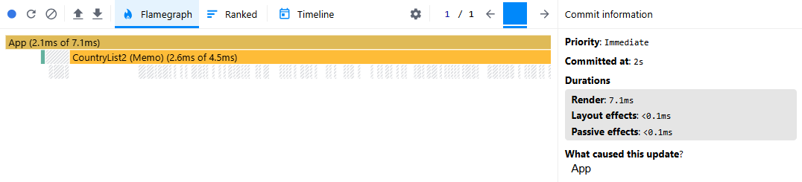 |
| 📈 Ranked Chart – Click on Search Input |  | _No re-renders observed_              |
| 📈 Ranked Chart – Typing                |  | 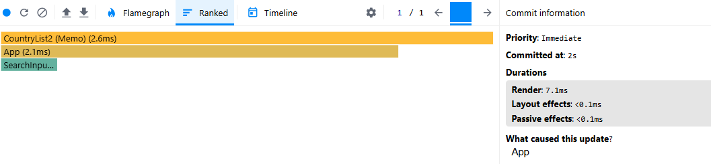 |
| 🕒 Timeline                             |    | 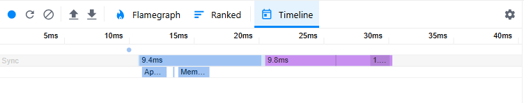 |

---

### 📊 Profiling Results of Click on Country Card

#### 🧪 Actions Performed

- Clicked on a country card to mark it as visited

#### ✅ Summary of Observations

- **Before Optimization**:
  Clicking a country card triggered re-renders in `CountryList` and all 250 `Country List Item` components. The main causes were a non-memoized `visitCountry` function and updates to the `isVisited` prop. Commit duration was **\~34.3 ms**, primarily from re-rendering all list items. **After Optimization**: Only `CountryList` and a single `CountryListItem` re-rendered due to actual changes in `isVisited`. Other items remained stable with the help of `React.memo` and `useCallback`.

- Commit duration decreased from **\~34.3 ms** before optimization to **\~2.9 ms** after.

The detailed performance metrics are shown below.

| Interaction        | Component                 | Render Reason (Before)                  | Render Reason (After)               | Render Duration (Before) | Render Duration (After) | Commit Duration (Before) | Commit Duration (After) |
| ------------------ | ------------------------- | --------------------------------------- | ----------------------------------- | ------------------------ | ----------------------- | ------------------------ | ----------------------- |
| Click Country Card | `CountryList`             | Updated due to `visitedCountries` state | Skipped unnecessary re-renders      | \~6.8 ms                 | \~2.9 ms                | \~6.8 ms                 | \~2.9 ms                |
|                    | `Country List Item` (250) | Re-created `onClick` callback per item  | Only 1 updated via `isVisited` prop | \~0.2–0.3 ms per item    | \~0.3 ms                | \~27.5 ms total          | \~0.3 ms total          |

---

### 🖼️ Visual Chart Comparison - Click Country Card

| View                    | Before Optimization                | After Optimization                   |
| ----------------------- | ---------------------------------- | ------------------------------------ |
| 🔥 Flame Graph – Click  | 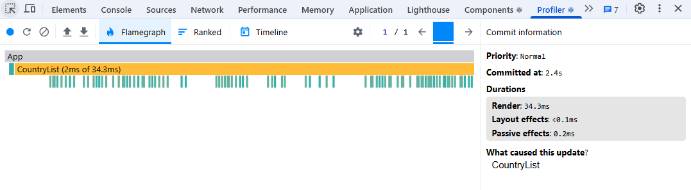 | 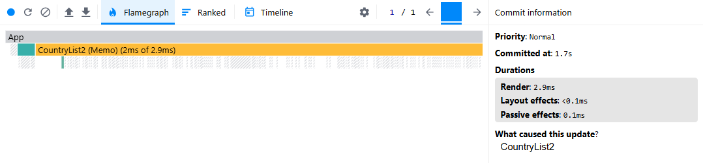 |
| 📈 Ranked Chart – Click | 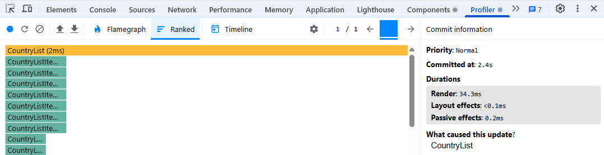 | 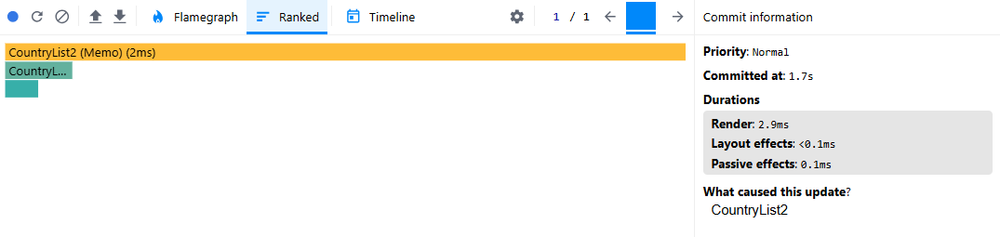 |
| 🕒 Timeline – Click     | 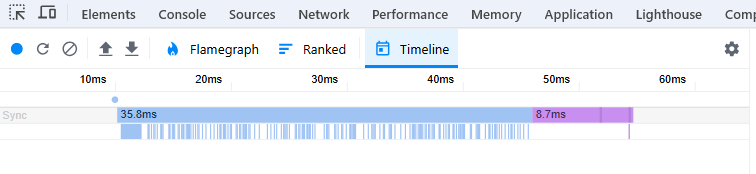 | 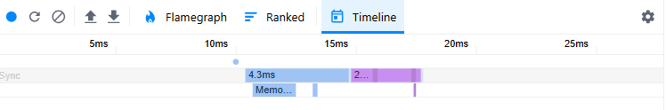 |
