## 📌 Project Description

The application loads and displays a list of countries, allowing users to filter, search, and sort them. The main focus of this task is optimizing performance using `React.memo`, `useMemo`, and `useCallback`.

---

### 📊 Profiling Results of Filter By Region

#### 🧪 Actions Performed

- Clicked on the region Select dropdown
- Selected a specific region (e.g., "Americas") to filter the country list

#### ✅ Summary of Observations

- All components in the filtering panel (`Select`, `CountryFilteringPanel`, `SearchInput`) re-rendered during both interactions
- `CountryList` and its 250 `CountryListItem` children were re-rendered on both dropdown interaction and region selection
- Re-renders were primarily caused by unstable props (`onChange`, `onClick`) and object references
- Overall commit duration exceeded **150 ms**, mostly due to redundant re-renders of country list items

The detailed performance metrics are shown below.

| Interaction    | Component               | Render Reason (Before)                                    | Render Reason (After) | Render Duration (Before) | Render Duration (After) | Commit Duration (Before) | Commit Duration (After) |
| -------------- | ----------------------- | --------------------------------------------------------- | --------------------- | ------------------------ | ----------------------- | ------------------------ | ----------------------- |
| Click dropdown | `CountryList`           | Updated `sortConfig`, `selectedRegion`, rerendered parent |                       | \~32.8 ms                |                         | \~32.8 ms                |                         |
|                | `CountryListItem` (250) | Re-created `visitCountry` callback                        |                       | \~0.3–0.4 ms per item    |                         | \~80 ms total            |                         |
|                | `CountryFilteringPanel` | Updated `sortConfig` object and `onRegionChange` callback |                       | \~1 ms                   |                         | \~1 ms                   |                         |
|                | `Select` (3)            | New `onChange` handlers and changing `value` props        |                       | \~0.2–0.4 ms each        |                         | \~1 ms total             |                         |
|                | `SearchInput`           | New `onChange` from parent                                |                       | \~0.4 ms                 |                         | \~0.4 ms                 |                         |
| Select region  | `CountryList`           | Filtered countries list changed (`useMemo`)               |                       | \~39.8 ms                |                         | \~39.8 ms                |                         |
|                | `CountryListItem` (250) | Newly created `onClick`                                   |                       | \~0.3–0.4 ms per item    |                         | \~80 ms total            |                         |
|                | `CountryFilteringPanel` | Prop changes from parent                                  |                       | \~1 ms                   |                         | \~1 ms                   |                         |
|                | `Select` (3)            | Change in `value` and non-memoized `onChange`             |                       | \~0.2–0.4 ms each        |                         | \~1 ms total             |                         |
|                | `SearchInput`           | New `onChange` from parent                                |                       | \~0.4 ms                 |                         | \~0.4 ms                 |                         |

---

### 🖼️ Visual Chart Comparison - Filter by Region

| View                        | Before Optimization                  | After Optimization            |
| --------------------------- | ------------------------------------ | ----------------------------- |
| 🔥 Flame Graph – Click      | 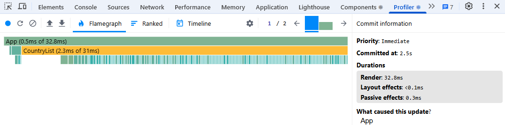  | _No re-renders observed_      |
| 🔥 Flame Graph – Selection  | 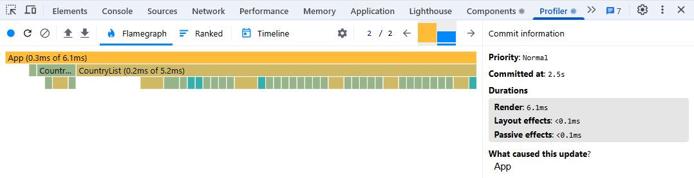 | _(Insert after optimization)_ |
| 📈 Ranked Chart – Click     | 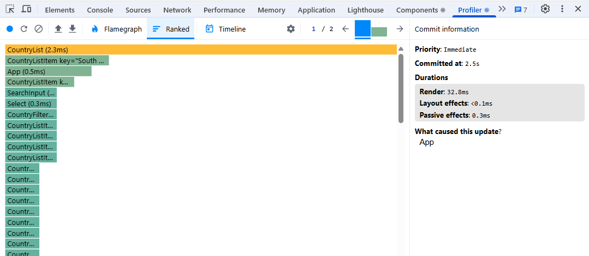 | _No re-renders observed_      |
| 📈 Ranked Chart – Selection | 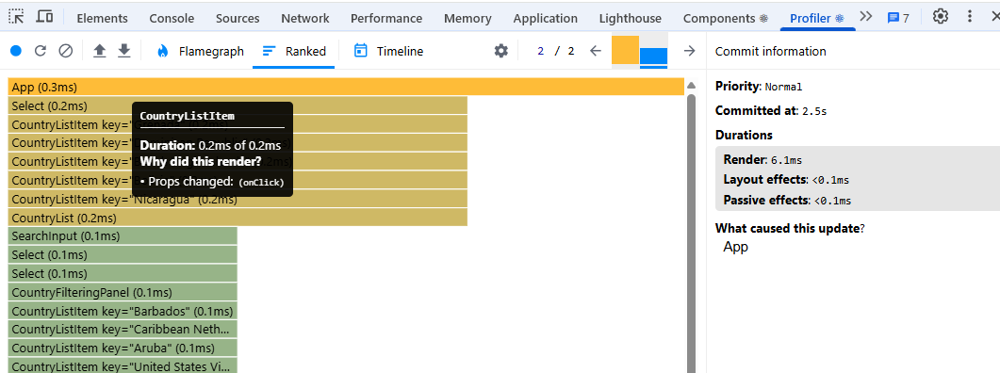 | _(Insert after optimization)_ |
| 🕒 Timeline                 | 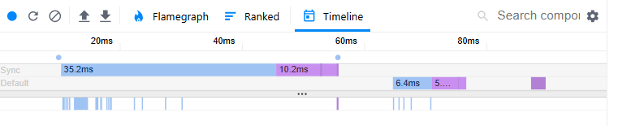 | _No re-renders observed_      |

---

### 📊 Profiling Results of Sort By Name

#### 🧪 Actions Performed

- Clicked on the "Sort by Name" dropdown
- Selected alphabetical sort order: `ascending`

#### ✅ Summary of Observations

- All components involved in sorting panel (`Select`, `CountryFilteringPanel`) re-rendered on both interactions
- `CountryList` and its 250 `CountryListItem` children were re-rendered as a result of sortConfig change
- Primary cause of re-renders: unstable `onChange`, recreated `onClick`, and `sortConfig` reference updates
- Total commit duration exceeded **140 ms**

The detailed performance metrics are shown below.

| Interaction                  | Component               | Render Reason (Before)                        | Render Reason (After) | Render Duration (Before) | Render Duration (After) | Commit Duration (Before) | Commit Duration (After) |
| ---------------------------- | ----------------------- | --------------------------------------------- | --------------------- | ------------------------ | ----------------------- | ------------------------ | ----------------------- |
| Click on Sort By Name Select | `CountryList`           | Rerender from sorting triggered by sortConfig |                       | ~33.5 ms                 |                         | ~33.5 ms                 |                         |
|                              | `CountryListItem` (250) | Re-created `onClick` callback per item        |                       | ~0.3–0.4 ms per item     |                         | ~86 ms total             |                         |
|                              | `CountryFilteringPanel` | Updated due to new sort handler               |                       | ~1.2 ms                  |                         | ~1.2 ms                  |                         |
|                              | `Select` (3)            | onChange recreated, value changed             |                       | ~0.3–0.4 ms each         |                         | ~1 ms total              |                         |
|                              | `SearchInput`           | Stable props, no significant change           |                       | ~0.3 ms                  |                         | ~0.3 ms                  |                         |
| Select ASC Sorting           | `CountryList`           | Sorted list recalculated, triggered rerender  |                       | ~39.2 ms                 |                         | ~39.2 ms                 |                         |
|                              | `CountryListItem` (250) | New onClick reference, rerender all           |                       | ~0.3–0.4 ms per item     |                         | ~84 ms total             |                         |
|                              | `CountryFilteringPanel` | New sortConfig reference                      |                       | ~1.1 ms                  |                         | ~1.1 ms                  |                         |
|                              | `Select` (3)            | Value and onChange updated                    |                       | ~0.3–0.4 ms each         |                         | ~1 ms total              |                         |
|                              | `SearchInput`           | Unchanged                                     |                       | ~0.3 ms                  |                         | ~0.3 ms                  |                         |

---

### 🖼️ Visual Chart Comparison - Sort by Name

| View                        | Before Optimization                    | After Optimization            |
| --------------------------- | -------------------------------------- | ----------------------------- |
| 🔥 Flame Graph – Click      | 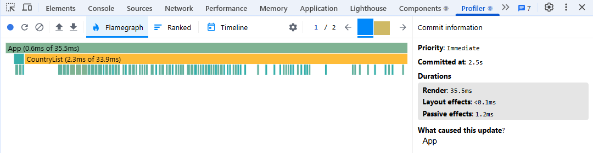 | _No re-renders observed_      |
| 🔥 Flame Graph – Selection  | 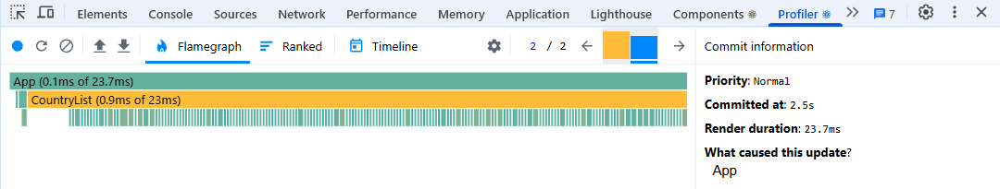 | _(Insert after optimization)_ |
| 📈 Ranked Chart – Click     | 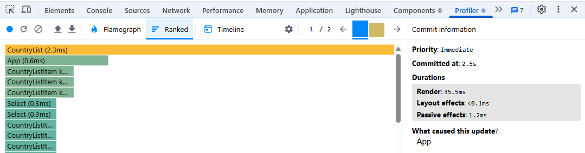 | _No re-renders observed_      |
| 📈 Ranked Chart – Selection | 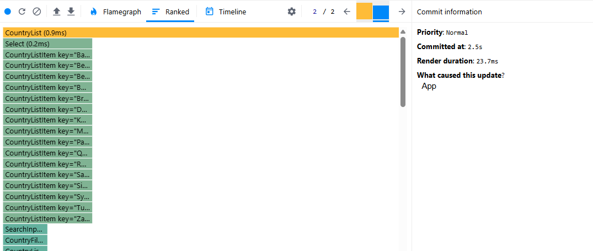 | _(Insert after optimization)_ |
| 🕒 Timeline                 |     | _No re-renders observed_      |

---

### 📊 Profiling Results of Search Country

#### 🧪 Actions Performed

- Clicked on the "Search" Input
- Typed "i" in it

#### ✅ Summary of Observations

- Clicking on the search input triggered re-renders in `SearchInput`, `Select`, and `CountryFilteringPanel`
- Typing caused the `CountryList` to apply filters, leading to full re-renders
- 250 `CountryListItem` components were re-rendered due to re-created `onClick` handlers
- `SearchInput` re-rendered with a new `onChange` prop, though the reference stayed mostly stable
- Commit duration reached ~27.2 ms; most of the render time came from list items

The detailed performance metrics are shown below.

| Interaction           | Component               | Render Reason (Before)                        | Render Reason (After) | Render Duration (Before) | Render Duration (After) | Commit Duration (Before) | Commit Duration (After) |
| --------------------- | ----------------------- | --------------------------------------------- | --------------------- | ------------------------ | ----------------------- | ------------------------ | ----------------------- |
| Click on Search Input | `CountryList`           | Re-renders due to filtering and search config |                       | ~27.2 ms                 |                         | ~27.2 ms                 |                         |
|                       | `CountryListItem` (250) | Non-memoized `onClick` recreated per render   |                       | ~0.2–0.3 ms per item     |                         | ~65 ms total             |                         |
|                       | `CountryFilteringPanel` | Prop `onSort` updated                         |                       | ~0.6 ms                  |                         | ~0.6 ms                  |                         |
|                       | `Select` (3)            | Updated `onChange` and `value` props          |                       | ~0.1–0.2 ms each         |                         | ~0.6 ms total            |                         |
|                       | `SearchInput`           | New `onChange` handler from parent            |                       | ~0.6 ms                  |                         | ~0.6 ms                  |                         |
| Type in Search Input  | `CountryList`           | Search filter applied, `useMemo` recalculated |                       | ~27.2 ms                 |                         | ~27.2 ms                 |                         |
|                       | `CountryListItem` (250) | Recreated `onClick`                           |                       | ~0.2–0.3 ms per item     |                         | ~65 ms total             |                         |
|                       | `CountryFilteringPanel` | Parent props updated                          |                       | ~0.6 ms                  |                         | ~0.6 ms                  |                         |
|                       | `Select` (3)            | `value` and `onChange` updated                |                       | ~0.1–0.2 ms each         |                         | ~0.6 ms total            |                         |
|                       | `SearchInput`           | `onChange` reference stable                   |                       | ~0.6 ms                  |                         | ~0.6 ms                  |                         |

---

### 🖼️ Visual Chart Comparison - Search Country

| View                        | Before Optimization                   | After Optimization            |
| --------------------------- | ------------------------------------- | ----------------------------- |
| 🔥 Flame Graph – Click      | 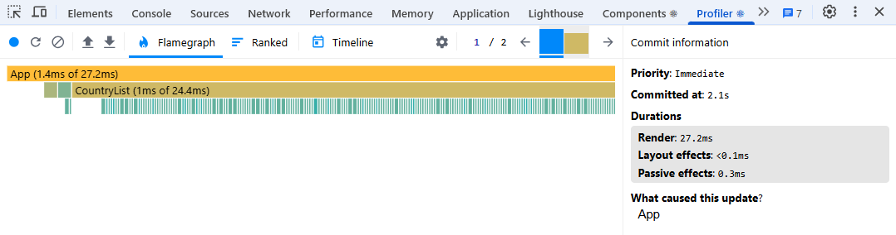 | _No re-renders observed_      |
| 🔥 Flame Graph – Selection  | 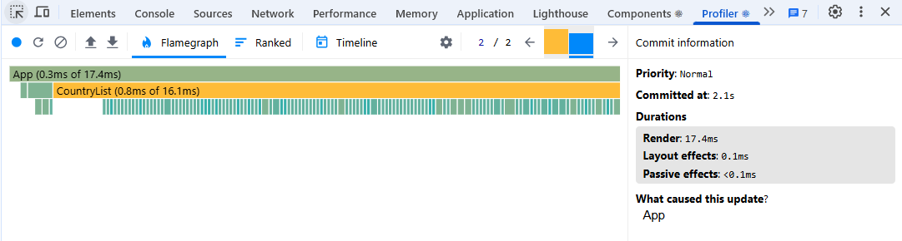 | _(Insert after optimization)_ |
| 📈 Ranked Chart – Click     | 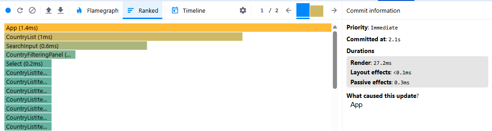 | _No re-renders observed_      |
| 📈 Ranked Chart – Selection | 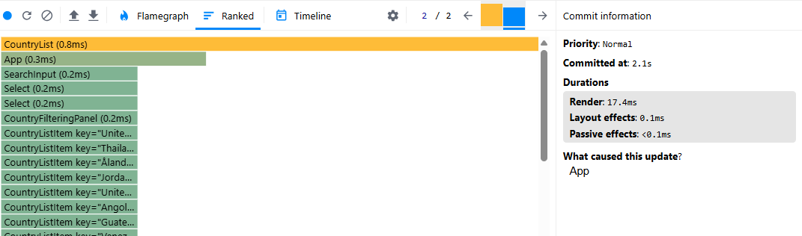 | _(Insert after optimization)_ |
| 🕒 Timeline                 | 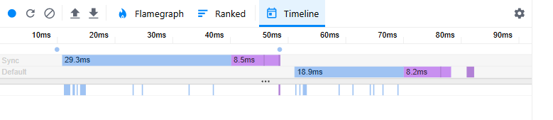   | _No re-renders observed_      |
